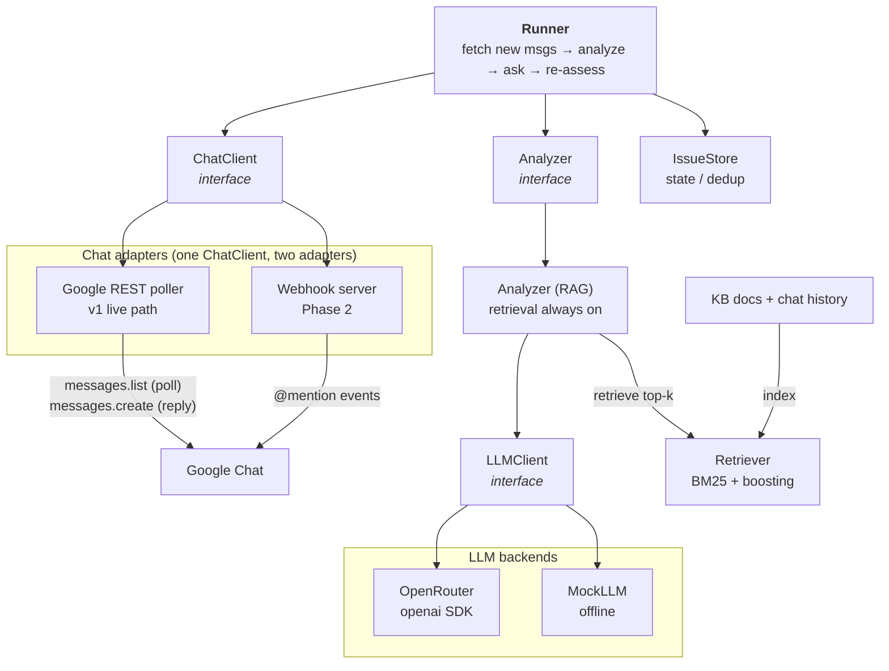

# Implementation Plan — Google Chat "Issue-Spotter" AI Agent

> **Status:** Plan for review. No code written yet. Once you approve this, the build
> proceeds in the phases described in [§13](#13-build-phases--milestones).

---

## 1. Source requirements

Verbatim from the original brief:

1. Create an AI agent, integrate to Google Chat.
2. The AI agent should read all the messages, and find out any issue in the group chat.
3. If there is any issue, the AI agent should ask a lot of questions until it is clear.
4. The manager requires RAG features. If RAG turns out to be unnecessary / not optimal,
   create **two versions** — one with RAG, one without RAG.

### Interpretation

- **"Issue"** = anything in a work group chat that needs clarification or action before it
  can move forward: a blocker, a bug/incident report, a vague or under-specified request, a
  decision that is needed but not made, a risk, an unanswered question, conflicting
  statements, or missing information (owner, deadline, scope, acceptance criteria, numbers).
- **"Ask a lot of questions until it is clear"** = a multi-round clarification loop. For each
  open issue the agent posts targeted questions, reads the human replies, re-assesses whether
  the issue is now *clear* (enough information to act), and either asks sharper follow-ups or
  marks the issue resolved — bounded by a safety cap on rounds.

---

## 2. Decisions locked (from clarifying Q&A)

| Area | Decision | Notes |
|---|---|---|
| Language / runtime | **Python**, targeting the `igaming` conda env (Python 3.14) | matches existing tooling (`ty`, the Google Chat docs) |
| LLM provider | **OpenRouter** (OpenAI-compatible API) reached via the official **`openai` Python SDK** (`base_url`→OpenRouter), *not* the direct Anthropic API | model chosen via `OPENROUTER_MODEL` env var; provider abstracted behind an `LLMClient` interface (OpenAI-SDK + Mock impls) |
| LLM observability | **Langfuse**, optional `[observability]` extra, lazy-imported | drop-in `from langfuse.openai import openai` wrapper auto-traces every call; `@observe()` groups each issue's detect→clarify→resolve loop into one session. Off when `OBSERVABILITY=none` (the mock/CI path imports nothing) — see §5.9 |
| Chat integration | **REST poller = primary live ingress**; webhook (@mention) **deferred to Phase 2** | one `ChatClient` interface, two adapters (poller, webhook) + a test-only in-memory fake. Webhook can't block on the LLM within Chat's sync-response window, so it needs fast-ack + async post (see §5.4) — off the v1 demo path |
| Chat auth | **User OAuth** (validated live 2026-06-13, §7) — each of the 3 agents is a **personal Google account** with its own refresh token; scopes `chat.messages` (read+write), `chat.messages.readonly`, `chat.spaces.create` | **no Workspace, no admin approval, no service account, no incoming webhooks.** Posts attributed to the **user** (`sender.type=HUMAN`), text-only. Costs: your own Desktop OAuth client + a *dormant* Chat-app config in the project + once-per-account consent (Testing-mode refresh tokens expire weekly) — see §7 |
| Run without keys | **Deterministic mock LLM + an in-memory fake `ChatClient`** for the unit/CI tests; real OpenRouter + real Google Chat for dev and the demo | no offline simulator — the demo is the live 3-agent space |
| RAG scope | **Index chat history *and* an external knowledge base** (iGaming policies / runbooks / FAQ / past incidents) | best showcase of when RAG earns its cost |
| Analyzer | **RAG-only** — one retrieval-augmented analyzer; no separate non-RAG version | direct-context reasoning core kept *internally* as the empty-`KB_DIR` fallback; default retriever is BM25 + boosting (zero-dep) |
| Demo | **Three agents in one real Google Chat space**: 2 LLM-driven *staff* personas (each its **own personal Google account**, user OAuth) that post issue-laden messages **and** answer the bot's questions, plus the **issue-spotter bot** we build (detect → clarify → report). | staff personas reuse `LLMClient` + `ChatClient`; see §5.8 + §11 |
| Dependency posture | **Stdlib-first with two deliberate exceptions: the `openai` SDK (core, LLM transport) and `langfuse` (optional `[observability]` extra).** Everything else — RAG, agent, staff personas, tests with an in-memory fake `ChatClient`, the real Google Chat client, **and the user-OAuth token mint/refresh** — runs on stdlib `urllib` (OAuth loopback + refresh proven in `smoke/get_token.py`). `openai` is pure-Python (3.14-safe) and lazy-imported, so the mock/CI path still needs no install or key; the optional Phase-2 webhook bearer-token verification pulls `google-auth` (`[google]` extra). | LLM transport + observability are the only third-party deps; the Google Chat + OAuth path stays stdlib |

---

## 3. Why RAG (and how it degrades gracefully)

**Decision: ship a single RAG analyzer — no separate non-RAG version.** The manager requires
RAG features, and once you want domain-grounded issue detection RAG earns its keep, so rather
than maintain two products we commit to RAG and make it **degrade gracefully**: with an empty
knowledge base retrieval is **bypassed** and the conversation is passed directly, behaving like a
direct-context analyzer.
The default retriever is zero-dep (BM25 + boosting), so RAG-only adds **no** dependency of its own
(the only core dep is the `openai` SDK for LLM transport, §2/§9).

### Why a bare channel barely needs RAG (the fallback case)

- The unit of work is **one group chat**. Modern models served via OpenRouter have 128K–1M
  token context windows; an entire active channel (even months of history) usually fits.
  Feeding the conversation **directly** into the prompt is simpler, cheaper to operate, lower
  latency, and has fewer failure modes than a retrieval pipeline (no chunking/index/embedding
  drift, no "retrieved the wrong passage" errors).
- Issue detection and clarifying questions are reasoning over the *conversation itself* —
  the relevant context is already in front of the model.

### Where RAG genuinely earns its place

1. **Grounding in an external knowledge base.** To judge whether something is an *issue* you
   often need domain knowledge the chat does not contain: "is RTP 91% out of policy?",
   "does this promo need compliance sign-off?", "what's the runbook for a failing payment
   webhook?". RAG over policies/runbooks/specs/past incidents lets the agent (a) recognize
   issues that require domain knowledge to spot, (b) ask *informed* questions, and (c) **avoid
   re-asking what is already documented**.
2. **Very long / multi-channel history.** When history exceeds the context window — or is too
   expensive to resend on every polling cycle — retrieve only the passages relevant to the
   current issue instead of the whole transcript.

### How it's wired

- **One `Analyzer`** with retrieval always on (§5.6): a direct-context reasoning core does the
  detection / question / clarity reasoning, and retrieval injects KB + history passages before
  each LLM call.
- **No `USE_RAG` toggle, no `--no-rag` build.** The lever is the **knowledge base**: an empty
  `KB_DIR` ⇒ retrieval is **bypassed** and the full recent transcript is passed directly (true
  direct-context — no BM25 dropping a key message); a populated `KB_DIR` ⇒ domain-grounded
  detection and questions, with retrieved KB+history passages **supplementing** (not replacing)
  the transcript. `RAG_DENSE=true` optionally adds dense⊕BM25 fusion (§5.5).
- This satisfies requirement #4: RAG turned out to be the optimal path, so we ship it — and
  document here *why*, including the cheaper direct-context behavior it subsumes as a fallback.

---

## 4. High-level architecture



> **Demo cast (§5.8):** 2 LLM *staff* personas (each its own personal Google account) post into the
> real Google Chat space and answer the bot — they enter through the same `ChatClient` ingress as any
> participant, not a new path.

### Ingress modes (don't conflate them)

- **`spaces.messages.list` poller** — the only way to "read *all* messages"; the caller must
  be a **member of the space**. This is the v1 live path.
- **`spaces.spaceEvents.list`** — a *separate REST pull* (not an HTTP push): requires a
  `filter` with `eventTypes:` and only looks back 28 days. Optional alternative ingress,
  **not** the webhook.
- **HTTP webhook** — receives interaction events (@mention / DM / added) only, and must answer
  within Chat's synchronous-response window. **Deferred to Phase 2** (see §5.4); the v1 demo
  uses the poller.

### Data flow (one cycle)

1. **Fetch** new messages since the last cursor (`ChatClient.fetch_messages`).
2. **Detect** issues over the (recent) conversation (`Analyzer.detect_issues`), deduped
   against already-known issues in the `IssueStore`.
3. For each **open** issue, **assess clarity** (`Analyzer.assess_clarity`). If not clear and
   under the round cap, **generate questions** (`Analyzer.generate_questions`) and **post**
   them back to the chat (threaded reply on the triggering message).
4. Replies (staff/human) arrive as new messages on the next cycle → loop. When an issue becomes
   clear, mark it `resolved`, **generate a Markdown resolution report and save it to disk**
   (`REPORTS_DIR/issue-<id>.md`, written atomically), and **post a concise confirmation to the
   issue's Chat thread** that references the report (see §6).
5. Retrieval runs every cycle when `KB_DIR` is populated: before the detect/assess/question LLM
   calls the analyzer retrieves the top-k relevant KB passages + prior chat snippets and injects
   them to **supplement** the transcript. With an empty `KB_DIR` retrieval is **bypassed** and the
   full recent transcript is passed directly — the graceful direct-context fallback.

---

## 5. Component design

### 5.1 `config.py`
- Env-driven settings via a tiny stdlib `.env` loader (no `python-dotenv`).
- Keys: `OPENROUTER_API_KEY`, `OPENROUTER_MODEL` (default `deepseek/deepseek-v4-flash`; also
  e.g. `anthropic/claude-3.5-sonnet`, `openai/gpt-4o-mini`, …), `OPENROUTER_BASE_URL`,
  `LLM_PROVIDER` (`openrouter`|`mock`),
  `GOOGLE_SPACE`, `GOOGLE_OAUTH_CLIENT` (shared Desktop OAuth client JSON), `GOOGLE_TOKEN_FILE`
  (this agent's user-OAuth refresh-token JSON — one per account), `GOOGLE_QUOTA_PROJECT`,
  `POLL_INTERVAL_SECONDS`,
  `POLL_BACKFILL_SINCE` (empty ⇒ start from agent startup; no history backfill),
  `DETECT_WINDOW_MESSAGES` (recent-transcript bound for detection),
  `MAX_CLARIFY_ROUNDS`, `STALE_AFTER_IDLE_CYCLES`, `RESOLVE_CONFIDENCE_THRESHOLD`, `KB_DIR`, `RAG_TOP_K`, `RAG_DENSE`,
  `STATE_FILE`, `REPORTS_DIR` (where resolution reports are written), `WEBHOOK_PORT`,
  `WEBHOOK_AUTH_AUDIENCE`,
  `OBSERVABILITY` (`none`|`langfuse`), `LANGFUSE_HOST`, `LANGFUSE_PUBLIC_KEY`, `LANGFUSE_SECRET_KEY`.
- Sensible defaults so the mock-LLM test path needs no configuration.

### 5.2 `models.py` (dataclasses + JSON)
- `Message{ id, space, thread_id, sender, sender_type(human|app), text, create_time }`
- `Issue{ id, fingerprint, title, summary, category, severity(low|med|high),
  status(open|clarifying|resolved|stale), thread_id, root_message_id, source_message_ids,
  missing_info[], questions_asked[], qa[] (question→answer pairs captured as replies arrive),
  last_bot_message_id, last_question_at, rounds, idle_cycles, report_written_at, created_at,
  updated_at }`. `fingerprint` = hash(`thread_id` + `root_message_id` (earliest source message) +
  `category`) — anchored on deterministic fields so it stays stable when the LLM returns a slightly
  different `source_message_ids` set or flips the category across non-deterministic calls; extra
  source ids are **merged** into the existing issue. `thread_id` ties the issue to its Chat thread
  so replies map back to it.
- `ClarityAssessment{ is_clear, confidence, missing_info[], rationale }`
- `ResolutionReport{ issue_id, title, category, severity, summary, resolution, qa[] (the
  clarifying question→answer pairs), source_message_ids, resolved_at }` — rendered to Markdown
  for the on-disk report and condensed into the Chat-thread confirmation.
- `Conversation` helper (ordered messages, rendering to a compact transcript for prompts).
- All serializable to/from JSON for the state file.

### 5.3 LLM layer (`llm/`)
- `base.py` — `LLMClient` protocol: `chat(system, messages) -> str` and a
  `complete_json(system, user, schema_hint) -> dict` helper with **robust JSON extraction**
  (strip code fences, find first `{…}`), since not all OpenRouter models honor
  `response_format`.
- `openrouter.py` — wraps the official **`openai` SDK**
  (`OpenAI(base_url=OPENROUTER_BASE_URL, api_key=OPENROUTER_API_KEY)`) calling
  `chat.completions.create`. Sends `model`, `messages`, `temperature`, optional
  `response_format`, and the recommended `HTTP-Referer`/`X-Title` default headers. Relies on the
  SDK's built-in timeouts + retries, with extra backoff on `429`/`5xx`. When
  `OBSERVABILITY=langfuse` it sources its client from `langfuse.openai` (a drop-in for `openai`,
  identical API) so every call is auto-traced with no call-site changes — see §5.9.
- `mock.py` — deterministic, rule-based stand-in (keyword + heuristic issue detection and
  templated questions) so the whole test suite runs with **no API key**.

### 5.4 Chat layer (`chat/`)
- `base.py` — `ChatClient` protocol:
  `fetch_messages(since) -> list[Message]`, `post_message(text, thread_id=None) -> Message`,
  `post_reply(message, text) -> Message`. A small **in-memory fake** implementing this protocol
  lives under `tests/` (not a shipped component) so the loop and analyzer tests run offline with
  no network.
- `google_rest.py` — the **primary live client**, shared by the bot and the staff (each instance
  bound to one account's token). **Auth = user OAuth** (validated §7): scopes `chat.messages`
  (read+write), `chat.messages.readonly`, `chat.spaces.create`. Reads with `spaces.messages.list`;
  query params `filter='createTime > "<RFC-3339>"'` (RFC-3339 **double-quoted**), `orderBy=ASC`
  (default; `createTime ASC` is **not** valid), `pageSize=1000`, and **paginate** until
  `nextPageToken` is empty (default page size 25 → bursts get dropped otherwise). Cursor is the
  **last processed message `name` + a bounded seen-id set** (a strict `createTime >` plus clock skew
  can drop/dupe at equal timestamps), persisted in state. **First run seeds the cursor to start
  time** (`POLL_BACKFILL_SINCE` overrides) — no history backfill. Posts with `spaces.messages.create`
  as a threaded reply: body `thread:{name: <source.thread.name>}`, query
  `messageReplyOption=REPLY_MESSAGE_FALLBACK_TO_NEW_THREAD`, stable `requestId`
  (`client-issue-{id}-r{n}`). Exponential backoff on `429 / RESOURCE_EXHAUSTED`. **All HTTP *and* the
  OAuth token refresh go through stdlib `urllib`** (refresh proven in `smoke/get_token.py`) — **no
  `google-auth` / `google-api-python-client` needed.** Posts are attributed to the **account's user**
  (`sender.type=HUMAN`), text-only. Sends `x-goog-user-project: <GOOGLE_QUOTA_PROJECT>`. See §7.
- `oauth.py` — minimal stdlib user-OAuth: loads the shared Desktop client (`GOOGLE_OAUTH_CLIENT`) +
  a per-account refresh-token JSON (`GOOGLE_TOKEN_FILE`), refreshes the access token over `urllib`,
  and hands a bearer token to `google_rest.py`. A one-shot loopback `authorize` flow (exactly
  `smoke/get_token.py`) mints each account's refresh token; promoted to `scripts/authorize.py`.
- `webhook.py` (**Phase 2, off the v1 demo path**) — a **stdlib `http.server`** endpoint (no
  Flask) for the Google Chat app contract: `ADDED_TO_SPACE` / `MESSAGE` interaction events
  (@mention / DM only — *not* a full space feed). A Chat app must answer within the
  synchronous-response window, which a real LLM call will exceed, so it **fast-acks** and posts
  the actual reply asynchronously via the same poller pipeline (one shared, deduped ingestion
  path — never two consumers processing the same message). Bearer-token verification of
  Google's request is **mandatory** (audience = project number / app URL); reject
  missing/invalid tokens. `google-auth` lazy-imported for verification.

### 5.5 RAG layer (`rag/`)

**Design = lexical-hybrid by default, dense as an optional fused upgrade. No graph RAG** — our
query shape is *targeted passage lookup* ("is RTP 91% out of policy?", "runbook for a failing
payout webhook?"), not global sense-making, so a graph's build cost (LLM entity/relation
extraction over the whole corpus) and dependency weight aren't worth it (see §15).

- `base.py` — `Retriever` protocol: `retrieve(query, k) -> list[Passage]`, with
  `Passage{ text, source, section, kind(kb|chat), create_time, score }`. Any ranker (BM25,
  dense, fused) implements it, so the analyzer never changes when the backend does.
- `chunk.py` — split KB docs and long chat history into overlapping passages, tagged with
  metadata (`source`, `section`, `kind`, `create_time`) used for boosting.
- `bm25.py` — **pure-Python BM25** ranking (tokenize, term stats, score). No
  torch/faiss/embeddings ⇒ installs and runs on Python 3.14 with zero deps.
- `boost.py` — lexical-hybrid signals layered on BM25 and the **default retriever** (still
  zero-dep): **keyword/acronym exact-match boosting** for iGaming jargon BM25 stems poorly
  (`RTP`, `KYC`, ticket IDs, resource names) + **recency boosting** for chat snippets.
- `fuse.py` — **Reciprocal Rank Fusion (RRF)** combining two ranked lists (~10 lines), used to
  fuse BM25 with the optional dense retriever.
- `dense.py` (**optional, lazy `[embeddings]` extra**) — embeddings-based ranker (API or local
  model) fused with BM25 via `fuse.py`; the credible "advanced RAG" upgrade. Not imported
  unless `RAG_DENSE=true`, so the default path stays dependency-free.
- `store.py` — builds the index from `KB_DIR` docs **and** recent chat history; exposes the
  `Retriever` interface. The "query" is the issue text / triggering message. Default wiring =
  BM25 + boosting; `RAG_DENSE=true` swaps in BM25⊕dense fusion.

### 5.6 Agent core (`agent/`)
- `prompts.py` — system + task prompts for detection, question generation, and clarity
  assessment; strict-JSON output contracts.
- `state.py` — `IssueStore`: persistence (JSON), **dedup** (match new detections to existing
  open issues so we don't re-raise the same thing), status transitions, round counting.
- `analyzer.py` — the single `Analyzer`. A small **direct-context reasoning core**
  (`detect_issues`, `generate_questions`, `assess_clarity`, prompt-building from the
  conversation) wrapped by retrieval: with a populated `KB_DIR` it pulls top-k KB + history
  passages from the `Retriever` and injects them to **supplement** the transcript before each LLM
  call. With an empty `KB_DIR` retrieval is **bypassed** and the analyzer passes the full recent
  transcript directly (the true direct-context path — avoids BM25 dropping a key message), so there
  is no separate non-RAG product to maintain — RAG is the one shipping path.
- `report.py` — `ResolutionReport` builder: when an issue is resolved it assembles the report
  from the `Issue` + its clarifying Q&A (optionally one LLM call for a crisp `summary` /
  `resolution`), renders **Markdown**, writes it to `REPORTS_DIR/issue-<id>.md` **atomically**
  (temp file + `os.replace`, `mkdir -p` the dir), and returns a short confirmation string for
  the runner to post to the thread. Pure-stdlib; no new deps.

### 5.7 `runner.py` + `scripts/`
- `runner.py` — the orchestration loop in §4, provider/adapter wiring, cursor + state
  persistence, the "ask until clear" controller with `MAX_CLARIFY_ROUNDS`. **Filters out only the
  bot's *own* messages** (match the bot's own user resource id `users/<id>` — **not** a blanket
  `sender.type` rule, or it would ignore the 2 staff agents and every other participant) before
  detection so its own questions aren't re-detected as issues, **gates** new question batches on a
  fresh reply from **any other participant** in the issue thread (§6), writes state **atomically**
  (temp file + `os.replace`), and enforces a **single active runner** via a lock file to avoid
  cursor/state races. On resolve it calls `report.py` to **write the Markdown report to disk** then
  posts the returned confirmation to the issue thread — both **once per issue**, guarded by
  `report_written_at` in state **and** a `REPORTS_DIR/issue-<id>.md` existence check so a state
  reload/edit can't double-write or double-post. When `OBSERVABILITY=langfuse`, the runner wraps
  each issue's per-cycle work in a Langfuse trace/session keyed by `issue.id` (via the
  `observability.py` shim, §5.9), so a multi-round clarification reads as one nested trace.
- `scripts/authorize.py` — **one-time per account**: run the OAuth loopback flow and save that
  account's refresh token (the build version of `smoke/get_token.py`).
- `scripts/run_poller.py` — real Google Chat polling loop (the issue-spotter bot).
- `scripts/run_webhook.py` — start the real webhook server (Phase 2).
- `scripts/run_staff.py` — run the **staff personas** (§5.8) against the live space (`--persona`
  selects the account/token).

### 5.8 Staff personas — the 2 demo "staff" agents (`agent/staff.py`, `scripts/run_staff.py`)
The demo runs **three agents in one real Google Chat space**: two LLM-driven *staff* personas plus
the issue-spotter bot. A `StaffAgent` is a thin participant that reuses the same `LLMClient` and
`ChatClient` (`google_rest.py`) as the bot, so it needs no new infrastructure.
- **Two jobs:** (a) **seed issues** — post messages from a persona + a lightweight scenario
  (`data/scenarios.json`: e.g. an ops engineer reporting a flaky payout webhook, a promo manager
  filing a vague launch request) that deliberately contain blockers / missing info / vague asks;
  (b) **answer the bot** — watch the thread, and when the bot asks a clarifying question, generate a
  persona-appropriate reply that reveals information **progressively** (one detail at a time) so the
  multi-round "ask until clear" loop is exercised and an issue actually reaches `resolved` → report.
- **Persona prompt** = role + the facts it holds + a withholding policy ("answer only what's
  asked"). Mock-LLM personas keep the offline tests deterministic; OpenRouter personas drive the
  live demo. The bot under test is a **separate** runner and shares no state with the staff.
- **Identity = separate personal Google accounts (user OAuth, validated §7).** Each staff is its own
  Gmail account with its own refresh token, so it posts as a **distinct HUMAN user** — natural for a
  "real people in a room" demo. Same path as the bot: one shared Desktop OAuth client, one refresh
  token per account, minted once via `scripts/authorize.py`. **No admin approval, no Workspace, no
  service account.** Reading the bot's questions uses each persona's own `chat.messages.readonly`
  access (or the driver reuses the bot's read). Staff posts show as the **account's user**, which the
  bot handles via "everyone but me" — it drops only its own `users/<id>` (§5.7/§6), so it detects
  staff messages and counts staff replies. Distinct staff need distinct accounts (user-auth posts
  carry the account identity); a **2-account fallback** (1 bot + 1 staff) is documented if making 3
  Gmail accounts is a hassle.
- **Run shape:** `run_staff.py` takes a persona id (`--persona ops|promo`) and can host one persona
  per process or both in one driver; each persona reads the bot's questions and routes each reply
  through **its own account's token**.

### 5.9 Observability — Langfuse (`observability.py`, optional)
**Lazy-imported, active only when `OBSERVABILITY=langfuse`** — the `mock`/CI path imports nothing,
preserving the offline, zero-config, no-key tests.
- **LLM tracing is automatic**: when enabled, `llm/openrouter.py` sources its client from
  `langfuse.openai` (drop-in for `openai`), so every `chat.completions.create` is captured with
  prompt, completion, model, token counts, **cost**, and latency — **no call-site changes**.
- **Agent-flow tracing**: `observability.py` exposes a no-op-safe `observe`/`trace` shim (the real
  `langfuse.observe` when enabled, an identity decorator otherwise). The runner wraps each issue's
  cycle in a **session/trace keyed by `issue.id`** so a full detect→clarify→re-assess→resolve loop
  reads as one nested trace across polling cycles, not scattered calls (§5.7).
- **Config**: `LANGFUSE_HOST`, `LANGFUSE_PUBLIC_KEY`, `LANGFUSE_SECRET_KEY` (§10); self-host
  (Docker) or cloud. Flushes on shutdown. No PII beyond the chat text already sent to the LLM.

---

## 6. Agent logic — issue detection & the "ask until clear" loop

**Detection.** First **drop only the bot's own messages** (match the bot's own user id `users/<id>` —
**not** a blanket `sender.type` rule; the 2 staff agents post as **HUMAN** users in the live demo
and must stay visible) from the transcript — otherwise the agent re-detects its own questions as
issues. One LLM call over the remaining recent transcript (bounded by `DETECT_WINDOW_MESSAGES`)
returns a JSON list of candidate issues, each with `title, summary, category, severity,
source_message_ids, missing_info[]`. The `IssueStore` dedups candidates by a **stable fingerprint**
= hash(`thread_id` + `root_message_id` (earliest source message) + `category`) — anchored on
deterministic fields, not the full LLM-chosen `source_message_ids` set (which drifts run-to-run);
new source ids are merged into the matching issue, with title/summary similarity as a secondary
check. Dedup runs against **open issues plus a tombstone set of resolved/stale fingerprints**, so a
closed issue is never re-raised from the same root message unless new human evidence arrives after
closure.

**Clarification loop (per open issue).**
```
# per cycle, per open issue — only the issue's OWN thread is considered
replies = new_messages_from_others_in(issue.thread_id, since=issue.last_bot_message_id)  # any sender ≠ bot
if replies and issue.questions_asked:            # capture Q→A for the report before re-assessing
    issue.qa.append({question: issue.questions_asked[-1],
                     answer_message_ids: [r.id for r in replies], text: join(replies)})
if issue.status == clarifying and not replies:
    issue.idle_cycles += 1                       # waiting on a reply — do NOT re-ask
    if issue.idle_cycles >= STALE_AFTER_IDLE_CYCLES:
        issue.status = stale                     # follow-up needed
    continue
assessment = analyzer.assess_clarity(issue, conversation[, retrieved_context])
if assessment.is_clear and assessment.confidence >= RESOLVE_CONFIDENCE_THRESHOLD \
        and not assessment.missing_info:
    issue.status = resolved
    report = build_resolution_report(issue, conversation)   # Markdown, from issue.qa[]
    save_to_disk(report, f"{REPORTS_DIR}/issue-{issue.id}.md")   # atomic; guarded once per issue
    issue.report_written_at = now
    post short confirmation referencing the report   # template below
elif issue.rounds < MAX_CLARIFY_ROUNDS:
    questions = analyzer.generate_questions(issue, conversation, assessment.missing_info)
    msg = post threaded questions on issue.thread_id   # REPLY_MESSAGE_FALLBACK_TO_NEW_THREAD
    issue.questions_asked.append(questions)
    issue.last_bot_message_id = msg.id; issue.last_question_at = now
    issue.rounds += 1; issue.idle_cycles = 0; issue.status = clarifying
else:
    issue.status = stale                         # round cap hit — follow-up needed
```
- **Resolved** = assessed clear **and** `confidence >= RESOLVE_CONFIDENCE_THRESHOLD` **and** no
  remaining `missing_info` (not LLM "looks clear" alone).
- **On resolve → report:** build a Markdown `ResolutionReport` (title, severity/category,
  summary, resolution, the clarifying Q&A from `issue.qa[]`, source-message refs, `resolved_at`)
  and **save it to disk** at `REPORTS_DIR/issue-<id>.md`; post a **concise** confirmation to the
  thread that references the report. Done **exactly once** per issue (guarded by `report_written_at`
  + a file-existence check).
- **Confirmation template** (≤2 lines, posted to the thread):
  `✅ Issue "<title>" resolved — <one-line resolution>. Report: reports/issue-<id>.md`.
- **Stop conditions:** resolved; round cap reached (→ `stale`); or no reply for
  `STALE_AFTER_IDLE_CYCLES` cycles (→ `stale`, follow-up needed).
- **Anti-spam:** the agent **never posts a follow-up until a new reply from another participant
  arrives in that issue's thread** — so a fast poll interval can't spam the channel. At most one
  question batch per issue per cycle; questions are specific and reference exactly what is missing
  (owner, deadline, scope, repro steps, expected vs actual numbers, acceptance criteria).
- The RAG version additionally checks retrieved KB before asking, so it can answer its own
  question from docs instead of bothering the team ("Per the KYC runbook, threshold is X — is
  this transaction above X?").

---

## 7. Google Chat integration specifics

(Confirmed against `docs/google_chat/` **and validated live on 2026-06-13** — see `smoke/` + `CLAUDE.md`.)

**Auth = user OAuth with personal Google accounts (no Workspace).** Smoke-tested end-to-end with a
consumer `@gmail.com`: list spaces, create a `SPACE` (`THREADED_MESSAGES`), post + list messages — all
HTTP 200. Each of the 3 agents is one Gmail account with its own refresh token.

- **Reading *all* messages** — the account must be a **member of the space**; call
  `spaces.messages.list` with scope `chat.messages.readonly` (or `chat.messages`). User OAuth sees the
  messages of spaces the user belongs to (no admin approval, no public-only limit).
  - **Paginate**: default `pageSize` 25 (max 1000); set 1000 and follow `nextPageToken` until empty.
  - **Filter/order**: `filter='createTime > "<RFC-3339>"'` (RFC-3339 **double-quoted**), `orderBy=ASC`
    (`ASC`/`DESC` only; `createTime ASC` is rejected). `filter` also supports `thread.name` to pull
    one issue's thread when assessing clarity.
  - **Cursor**: last processed message `name` + bounded seen-id set (a bare `createTime >` plus clock
    skew drop/dupe at equal timestamps); first run seeds to startup time (`POLL_BACKFILL_SINCE`
    overrides) — no backfill.
- **Posting questions back** — `spaces.messages.create`, scope `chat.messages`. **Posts are attributed
  to the account's user** (`sender.type=HUMAN`) and are **text-only** (no cards under user auth — fine
  for the demo). Reply in-thread with body `thread:{name:<source.thread.name>}` + query
  `messageReplyOption=REPLY_MESSAGE_FALLBACK_TO_NEW_THREAD` (the query-param `threadKey` is deprecated;
  the app-scoped `Thread.threadKey` still exists — unused). `messageReplyOption` works **only in named
  spaces**, so the demo space is `spaceType=SPACE` with `spaceThreadingState=THREADED_MESSAGES` (a
  created `SPACE` is threaded by default — verified). Stable `requestId` for idempotency; back off on
  `429 / RESOURCE_EXHAUSTED`.
- **Space + membership** — a user **creates** the space (`spaces.create`, scope `chat.spaces.create` —
  verified) or reuses one, and the other 2 accounts join (Chat UI invite, or `spaces.members.create`).
  No "app can't add itself" limitation — these are users, not an app.

**Setup gotchas that bit us (must be in `docs/SETUP_GOOGLE_CHAT.md`):**
1. **Use your OWN OAuth client (Desktop type).** gcloud's built-in client is **blocked** from Chat
   scopes ("This app is blocked"). Create one in your personal GCP project; loopback flow exactly as
   `smoke/get_token.py`.
2. **Configure a Chat app in the project** (Cloud console → *Chat API → Configuration*: app name +
   avatar + description). Without it, **every** call — even user-auth read — returns
   `404 "Google Chat app not found"`. The app config is **dormant**; we never use app auth or
   interactivity.
3. **OAuth consent screen = External + Testing**; add all 3 accounts as **test users**. Testing-mode
   refresh tokens **expire after 7 days** → re-consent weekly for a demo (or publish the app). Each
   account consents once via `scripts/authorize.py` to mint its refresh token.
4. **Quota project**: send `x-goog-user-project: <GOOGLE_QUOTA_PROJECT>` (the project with Chat API
   enabled).
5. **Browser account ≠ gcloud account.** Do console + consent in an Incognito window signed into the
   target Gmail, or append `authuser=<email>` to console URLs.

- **Webhook app** (**Phase 2**, optional, off the demo path) — @mention interaction events; must
  answer within Chat's synchronous-response window → **fast-acks** + async post through the poller
  pipeline. **Mandatory** bearer-token verification (audience = project number / app URL); this is the
  one place that would pull `google-auth`.
- **Demo setup (summary)** — one GCP project (Chat API enabled + a dormant Chat-app config), one
  Desktop OAuth client, **3 Gmail accounts** each added as a test user and consented once, one `SPACE`
  with all 3 as members, then run the bot + staff. Full steps in `docs/SETUP_GOOGLE_CHAT.md`.

---

## 8. Proposed project structure

```
gchat_agent/
├── PLAN.md                      # this document
├── README.md                    # quickstart + demo (build phase)
├── CLAUDE.md                    # project memory (build phase)
├── pyproject.toml               # metadata + optional extras ([google], [dev])
├── .env.example                 # config template
├── .gitignore
├── docs/
│   ├── google_chat/…            # existing API reference (kept)
│   ├── ARCHITECTURE.md          # build phase
│   ├── RAG_ANALYSIS.md          # build phase (expands §3)
│   └── SETUP_GOOGLE_CHAT.md     # build phase (expands §7)
├── src/gchat_agent/
│   ├── config.py  models.py  runner.py  observability.py
│   ├── llm/   base.py  openrouter.py  mock.py
│   ├── chat/  base.py  google_rest.py  oauth.py  webhook.py
│   ├── rag/   base.py  chunk.py  bm25.py  boost.py  fuse.py  store.py  (dense.py optional)
│   └── agent/ prompts.py  state.py  analyzer.py  report.py  staff.py
├── data/
│   ├── knowledge_base/          # RTP policy, payments runbook, promo checklist, KYC/compliance
│   └── scenarios.json           # staff-persona scripts: roles, issues to seed, facts they reveal
├── reports/                     # generated resolution reports issue-<id>.md (gitignored)
├── secrets/                     # OAuth client + per-account token JSONs (gitignored)
├── smoke/                       # validated user-OAuth smoke test (get_token.py, smoke_test_chat.py)
├── scripts/ authorize.py  run_poller.py  run_webhook.py  run_staff.py
└── tests/   fakes.py (in-memory FakeChatClient)  test_models.py  test_llm_mock.py  test_rag.py
            test_analyzer.py  test_loop.py  test_issue_store.py  test_report.py  test_staff.py
```

---

## 9. Dependencies & environment

- **Core deps:** the **`openai` SDK** (LLM transport) plus stdlib (`urllib.request`, `json`,
  `http.server`, `dataclasses`, `re`, `math`, `unittest`). `openai` is pure-Python and installs
  cleanly on the `igaming` (Python 3.14) env; it is **lazy-imported**, so the `mock` LLM path —
  and thus the whole offline test suite — runs with **no `openai` call and no API key**. The
  Google Chat + user-OAuth path stays **pure stdlib `urllib`** (proven in `smoke/get_token.py`).
- **Optional extras** (lazy-imported, documented):
  - `[observability]` → `langfuse` — LLM + agent-flow tracing (§5.9), active only when
    `OBSERVABILITY=langfuse`. Off by default; the mock/CI path imports nothing.
  - `[google]` → `google-auth` only — **only** for the optional Phase-2 webhook bearer-token
    verification.
  - `[embeddings]` (optional) → an embeddings backend for the dense retriever (§5.5), used only
    when `RAG_DENSE=true`. Off by default; the BM25 + boosting path needs none of it.
- BM25 RAG is pure-Python on purpose (avoids torch/faiss wheels that may lag Python 3.14).
- `ty` is not installed in this env; verification will use `python -m py_compile` and the
  `unittest` suite (mock LLM + in-memory fake `ChatClient`, no network). (Can add `ty` later if desired.)

---

## 10. Configuration (`.env.example`)

```
LLM_PROVIDER=openrouter          # or: mock
OPENROUTER_API_KEY=
OPENROUTER_MODEL=deepseek/deepseek-v4-flash
OPENROUTER_BASE_URL=https://openrouter.ai/api/v1
# LLM observability (optional — needs the [observability] extra)
OBSERVABILITY=none               # or: langfuse
LANGFUSE_HOST=https://cloud.langfuse.com   # or your self-hosted URL
LANGFUSE_PUBLIC_KEY=
LANGFUSE_SECRET_KEY=
RAG_DENSE=false                  # optional dense+BM25 fusion (needs the [embeddings] extra)
RAG_TOP_K=5
KB_DIR=data/knowledge_base
MAX_CLARIFY_ROUNDS=3
STALE_AFTER_IDLE_CYCLES=3
RESOLVE_CONFIDENCE_THRESHOLD=0.8
DETECT_WINDOW_MESSAGES=50         # recent-transcript bound for detection
STATE_FILE=.state/issues.json
REPORTS_DIR=reports              # resolution reports written to reports/issue-<id>.md
# Google Chat (real demo only — user OAuth, see §7)
GOOGLE_SPACE=spaces/XXXXXXXXX
GOOGLE_OAUTH_CLIENT=secrets/oauth_client.json   # your Desktop OAuth client_secret JSON (shared)
GOOGLE_TOKEN_FILE=secrets/token_bot.json        # this agent's refresh token (one per account)
GOOGLE_QUOTA_PROJECT=                            # GCP project id with Chat API enabled (x-goog-user-project)
POLL_INTERVAL_SECONDS=15
POLL_BACKFILL_SINCE=             # empty = start at agent startup (no backfill); RFC-3339 to backfill from a time
WEBHOOK_PORT=8080                # Phase 2 only
WEBHOOK_AUTH_AUDIENCE=           # Phase 2 only
```

---

## 11. Demo plan — 3 agents in one Google Chat space

The demo stages **two LLM staff personas** (§5.8) against the **issue-spotter bot** in a real Google
Chat space: the staff post issue-laden messages and answer the bot's questions; the bot detects,
clarifies over multiple rounds, resolves, and writes a report.

**Setup:** one GCP project (Chat API enabled + a **dormant Chat-app config**, §7), one **Desktop OAuth
client**, and **3 Gmail accounts** (bot + 2 staff) each added as a **test user** and consented once
(`scripts/authorize.py`) to mint its refresh token. Create a **named, threaded** `SPACE`
(`spaceType=SPACE`, `THREADED_MESSAGES`) and add all 3 accounts. **No Workspace, no admin approval.**
(2-account fallback: 1 bot + 1 staff.)

**Run:** start `scripts/run_poller.py` (the bot) and `scripts/run_staff.py` for each persona. The
staff post problems from `data/scenarios.json`; watch the bot reply with clarifying questions
in-thread until it posts a resolution report (and writes `reports/issue-<id>.md`). Set
`OPENROUTER_API_KEY` to drive all three with a real model; `data/knowledge_base/` populated vs empty
shows RAG's effect on the questions.

---

## 12. Testing strategy

- **stdlib `unittest`**, runnable via `python -m unittest discover tests` with zero installs.
- Coverage: model JSON round-trip; mock-LLM determinism; BM25 + keyword/recency boosting
  relevance ordering and RRF fusion of two ranked lists; the `Analyzer` end-to-end on a fixed
  transcript (mock LLM); `IssueStore` dedup + status
  transitions + round cap; **end-to-end clarification round-trip** over an in-memory
  `FakeChatClient` + a staff persona (mock LLM): detect → ask → persona answer → resolve;
  **resolution report** generation (Markdown rendering + atomic write to a temp `REPORTS_DIR`,
  written once per issue); **staff persona** driver (seeds an issue and answers a templated bot
  question via the mock LLM).
- The LLM is injected, so tests never hit the network.

---

## 13. Build phases & milestones

1. **Scaffold** — package layout, `config.py`, `models.py`, `.env.example`, `.gitignore`,
   `pyproject.toml`.
2. **LLM layer** — `LLMClient`, `OpenRouterClient` (`openai` SDK → OpenRouter), `MockLLM`, and
   the `observability.py` shim (Langfuse drop-in + `@observe`, no-op when disabled).
3. **Chat layer** — `ChatClient` + an in-memory `FakeChatClient` (tests), then `google_rest.py`
   + `oauth.py` (user-OAuth client, shared by bot + staff) and `scripts/authorize.py` (mint each
   account's refresh token, per `smoke/get_token.py`). `webhook.py` moves to a later, optional slice
   (see Phase 9).
4. **RAG layer** — chunking, BM25, keyword/recency boosting, RRF fusion, KB+history store
   (+ sample KB docs); optional dense backend stubbed behind the `Retriever` interface.
5. **Agent core** — prompts, `IssueStore`, the single retrieval-augmented `Analyzer`, and
   `report.py` (Markdown resolution report → disk).
6. **Runner + scripts** — orchestration loop + three entrypoints (poller, webhook, **staff**),
   plus the **2 staff personas** (`agent/staff.py`, `scripts/run_staff.py`, `data/scenarios.json`)
   that drive the 3-agent demo.
7. **Tests** — the `unittest` suite above.
8. **Docs + verify** — README, ARCHITECTURE, RAG_ANALYSIS, SETUP_GOOGLE_CHAT, fill
   `CLAUDE.md`; `py_compile` everything, run tests (mock LLM + fake `ChatClient`).
9. **Webhook (optional, Phase 2)** — `webhook.py` @mention interactions with fast-ack +
   async post through the poller pipeline; mandatory bearer-token verification.

Each phase is independently runnable; the mock-LLM test path is green from Phase 5 onward.

---

## 14. Risks & mitigations

| Risk | Mitigation |
|---|---|
| Python 3.14 wheels missing for ML/HTTP libs | stdlib-first where it counts; BM25 instead of embeddings; the only required third-party is the **pure-Python `openai` SDK** (3.14-safe, no native wheels), and the Google Chat + OAuth path stays on `urllib` |
| Adding `openai`/`langfuse` erodes the "runs today" property | both lazy-imported and gated: `openai` only on the live path (mock/CI imports neither), `langfuse` only when `OBSERVABILITY=langfuse` (`[observability]` extra). Offline tests need no install and no key |
| Google live demo needs OAuth setup | **mock-LLM + fake-`ChatClient` tests need zero Google setup.** The live demo uses **user OAuth** (no admin, no Workspace): your own Desktop OAuth client + a dormant Chat-app config + 3 test-user consents (§7). All validated 2026-06-13 (`smoke/`). |
| Testing-mode refresh tokens expire in 7 days; missing project Chat-app config → 404 | document both in SETUP; re-consent weekly via `scripts/authorize.py` (or publish the app); configure the project's (dormant) Chat app once (§7 gotchas 2–3) |
| OpenRouter model variance in JSON formatting | robust JSON extraction + a re-ask-on-parse-failure fallback |
| Agent over-asking / spamming the channel | **post follow-ups only after a new reply from another participant in the issue thread**, one batch per issue per cycle, round cap, idle→stale, fingerprint dedup, clarity gate |
| Agent re-detecting its own messages / ignoring the staff agents | filter out **only the bot's own** user id (`users/<id>`) — staff post as HUMAN users, so their posts and replies stay visible |
| Webhook can't answer within Chat's sync window | demote webhook to Phase 2; fast-ack + async post via the poller pipeline |
| Account can't read the space | each account **joins the space** (UI invite or `spaces.members.create`); scopes `chat.messages.readonly` (read) + `chat.messages` (write) — no admin approval |
| Lost/duplicated messages on poll | `pageSize=1000` + paginate; cursor by message `name` + seen-id set; idempotent posts via `requestId` |
| OpenRouter model slugs change over time | model is env-configurable, never hard-coded; default documented |
| Secrets in repo | `.gitignore` the OAuth client JSON + per-account token files + `.env` (already in place); only `.env.example` committed |

---

## 15. Out of scope (for now)

- **Graph RAG** (entity/relation graph + community summaries) — wrong query shape (we do
  targeted passage lookup, not global sense-making over the corpus), LLM-heavy to build, and
  would drag in heavy graph/embedding deps that break our lean-deps posture (§2). Not worth it
  for this corpus.
- Dense/vector RAG is **not the default but not excluded**: it's an optional, lazy
  `[embeddings]` retriever fused with BM25 via RRF (§5.5), off unless `RAG_DENSE=true`. The
  default lexical-hybrid (BM25 + boosting) is sufficient and dependency-free.
- Production deployment manifests (Cloud Run/Functions) beyond run instructions.
- Persistent DB (JSON state file is enough for the pilot).
- Multilingual handling beyond what the chosen model does natively.

---

## 16. Open questions for you

None open. Decisions since the last revision: **auth = personal Google accounts via user OAuth**,
**validated end-to-end live on 2026-06-13** (§7; tooling in `smoke/`) — no Workspace, no admin, no
service account, no incoming webhooks; this replaces the earlier app-auth / separate-Chat-apps idea.
The **3 agents = 3 personal Gmail accounts** (2-account fallback available). The core now takes
**one third-party dep — the `openai` SDK** for LLM transport — plus an optional `langfuse`
(`[observability]` extra, §5.9); both are lazy-imported and the Google Chat + user-OAuth path stays
stdlib `urllib`. Offline testing still uses a small
in-memory `FakeChatClient` + mock LLM. Real-world to-dos before the live demo: create 2 more Gmail
accounts (staff), add all 3 as test users on the consent screen, consent once each
(`scripts/authorize.py`). Ready to start at Phase 1 on your go-ahead.
