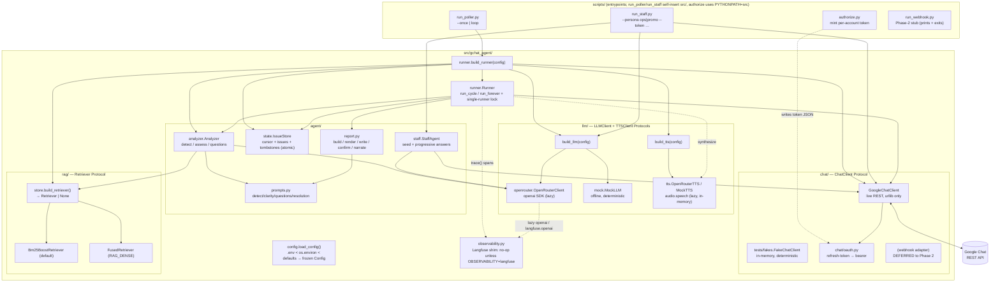
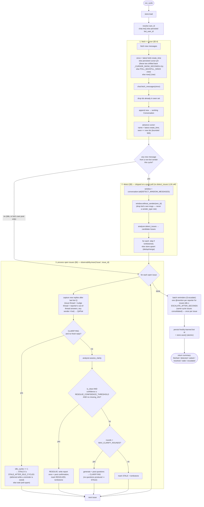

# Architecture

The `gchat_agent` is a Google Chat "issue-spotter" demo: an LLM-driven bot that
polls a Chat space, **detects** candidate issues in the conversation, **clarifies**
them by asking targeted questions until they are clear, then writes a **resolution
report** and posts a one-line confirmation back into the thread. Two LLM-driven
*staff personas* (ops + promo) share the same space and seed scenarios + answer the
bot's questions, so the whole detect → clarify → report loop runs end-to-end with
three personal Gmail accounts in one space.

This document describes the code as **built** (it supersedes PLAN §4). All paths are
relative to the repo root; modules live under `src/gchat_agent/`.

---

## 1. Component map



### Runner — `runner.py`

The orchestration loop. `Runner(chat, analyzer, store, config, reports_dir=None,
llm=None, tts=None)` holds a working `Conversation` that accumulates fetched messages across
cycles (full thread context preserved; detection is still windowed). `run_cycle()`
runs one fetch → detect → clarify/resolve iteration and returns a summary dict.
Detection's `detect_issues` LLM call is skipped on a quiet poll — a cycle that
brought no new *non-bot* message leaves the (own-filtered) detection window
unchanged, so re-running it would only re-derive the same candidates. This makes
an idle poll free of frontier-model round-trips, so `POLL_INTERVAL_SECONDS` can be
small without multiplying LLM cost.
`run_forever()` loops it under a single-runner lock, sleeping `POLL_INTERVAL_SECONDS`
between cycles. `build_runner(config)` wires the live stack (Google REST client +
OpenRouter LLM + optional retriever + analyzer + store) and is what `run_poller.py`
calls.

### ChatClient protocol + adapters — `chat/`

`chat/base.py` defines the `ChatClient` `Protocol` (runtime-checkable) the runner
codes against:

- `me() -> str | None` — the client's own `users/<id>` for self-filtering.
- `fetch_messages(since) -> list[Message]` — messages created after `since`
  (RFC-3339 or `None`), chronological.
- `post_message(text, thread_id=None, request_id=None) -> Message`
- `post_reply(message, text, request_id=None) -> Message`

Adapters:

- **`chat/google_rest.GoogleChatClient`** — the live path. Stdlib `urllib` only
  (no `google-api-python-client`). Reads via `spaces.messages.list`
  (`createTime > "…"` filter, `orderBy=ASC`, `pageSize=1000`, follows
  `nextPageToken`); posts via `spaces.messages.create` as a threaded reply
  (`messageReplyOption=REPLY_MESSAGE_FALLBACK_TO_NEW_THREAD`) with a stable
  `requestId` for idempotency. Exponential backoff on `429`/`5xx`/`RESOURCE_EXHAUSTED`;
  one re-auth retry on `401`. Learns its own `users/<id>` from the first posted
  message's `sender.name`. Bearer tokens come from `chat/oauth.py`, which trades a
  per-account refresh token for short-lived access tokens.
- **`tests/fakes.FakeChatClient`** — test-only in-memory implementation of the same
  protocol. Deterministic ids and `create_time` from a monotonic counter (no clock,
  no network), `request_id` idempotency, plus `inject()`/`seed()` to drop in messages
  from arbitrary senders. This is what makes the 145-test suite fully offline.
- **Webhook adapter** — **deferred to Phase 2.** `run_webhook.py` is a stub that
  prints a deferral notice and exits; there is no webhook ingress in v1. The REST
  poller is the only live ingress.

### Analyzer + Retriever + LLMClient — `agent/analyzer.py`, `rag/`, `llm/`

`Analyzer(llm, retriever=None, top_k=5)` drives the bot's three LLM tasks, each a
single `LLMClient.complete_json` call built from `agent/prompts.py` and parsed
against the object-wrapped JSON contracts:

- `detect_issues(conversation) -> list[Issue]` — renders the transcript with ids
  (`{"issues": [...]}`), mints a full OPEN `Issue` per candidate.
- `assess_clarity(issue, conversation) -> ClarityAssessment` — scopes to the issue's
  thread (`{"is_clear", "confidence", "missing_info", "rationale"}`).
- `generate_questions(issue, conversation, missing_info) -> list[str]` — deduped
  question strings (`{"questions": [...]}`).

`LLMClient` (`llm/base.py`, a `Protocol`) has `chat()` and `complete_json()`.
`build_llm(config)` returns `MockLLM` for `LLM_PROVIDER=mock`, or
`OpenRouterClient` for `openrouter` — which **raises a clear `RuntimeError` if
`OPENROUTER_API_KEY` is unset**. The OpenRouter client wraps the `openai` SDK
(lazy-imported) at the OpenRouter base URL; `complete_json` requests a JSON object
and falls back gracefully if the model rejects `response_format`, then pulls the
object out with `extract_json` (handles fenced / chatty replies).

`Retriever` (`rag/base.py`, a `Protocol`) returns the top-`k` `Passage`s for a
query. `rag/store.build_retriever(kb_dir, history=None, dense=False)` indexes KB
docs + recent history and returns a `Bm25BoostRetriever` (default, zero-dep) or a
`FusedRetriever` (BM25 ⊕ dense, RRF-fused, `dense=True`) — **or `None`** when there
is nothing to index. Retrieval only *supplements* the transcript: `retriever is None`
(empty/missing KB and no history) triggers the **direct-context bypass** (the full
transcript goes straight to the model); a populated KB adds a "Retrieved context"
block after the transcript. The repo ships a populated `data/knowledge_base/`
(`rtp_policy.md`, `payments_runbook.md`, `promo_checklist.md`,
`kyc_compliance.md`), so the live demo runs *with* retrieval by default;
clearing `KB_DIR` (or pointing it at an empty dir) returns `None` and falls back
to the direct-context bypass (the offline/test condition).

### IssueStore — `agent/state.py`

`IssueStore(state_file)` is the durable memory: it loads/saves the whole
`AgentState` blob (poll cursor + seen-id set + live issues + tombstone set). It
dedups detections against open issues by a stable `fingerprint`
(`models.issue_fingerprint(thread_id, root_message_id, category)`, where the
`category` is **normalized** — lower-cased, whitespace-collapsed). During
`upsert`, a secondary title/summary Jaccard tie-breaker (≥ 0.6) merges a candidate
into a matching **open** issue even when the LLM flips `category` and mints a new
fingerprint — but this tie-breaker runs **only against open issues**, never on the
tombstone check. Resolved/stale issues are **tombstoned**, so a closed issue is
not re-raised for the **same** `(thread, root, normalized-category)` fingerprint;
a *genuine* category flip after closure yields a **new** fingerprint that bypasses
the tombstone and can re-raise. Persistence is **atomic** (temp file + `fsync` + `os.replace` after
`mkdir -p`), so a crash mid-write can never corrupt the state file. Public surface:
`load`/`save`, `upsert`/`get`, `open_issues`/`all_issues`, `tombstone`/`is_tombstoned`,
`get_cursor`/`set_cursor`, `get_bot_user_id`/`set_bot_user_id`.

### Report — `agent/report.py`

`build_resolution_report(issue, llm=None)` assembles a `ResolutionReport` from the
issue's fields + its clarifying Q&A; an optional `llm.complete_json` call tightens
the summary/resolution prose (any LLM failure is swallowed — the report still
builds). `render_markdown(report)` produces the on-disk Markdown;
`write_report(report, reports_dir)` writes it **atomically** to
`reports/issue-<id>.md` (returns the path); `confirmation_line(report, report_ref=None)`
renders the one-line `✅ Issue "<title>" resolved — … Report: reports/issue-<id>.md`
posted into the thread (`report_ref` overrides the trailing reference for the voice
path).

**Voice delivery.** When `REPORT_DELIVERY` is `voice`/`both`, `build_narration(report,
llm)` writes a concise **spoken** script (plain prose, no Markdown — a deterministic
fallback covers `llm=None` / failures), `voice_caption(report)` is the attachment's
short caption, and the report is synthesized by an `llm/tts.py` `TTSClient`
(`OpenRouterTTS` over OpenRouter's `audio.speech`, or `MockTTS` offline) and posted
as an MP3 attachment via `chat.post_voice(...)`. The audio is built **in memory** and
never touches disk. Two user-OAuth REST steps deliver it: `media.upload` (the
`chat.messages` scope covers it) returns an `attachmentDataRef`, then
`spaces.messages.create` references it in the message's `attachment`. It targets
`GOOGLE_VOICE_SPACE` (a separate space / DM with another account) or, if unset,
threads into the issue's own space. Voice is **best-effort**: any failure (or no TTS
configured) falls back to the on-disk report so a resolution is never lost.

### StaffAgent — `agent/staff.py`

`StaffAgent(llm, chat, persona)` is a thin participant reusing the same `LLMClient`
and `ChatClient` as the bot. It (a) **seeds** a scenario's issue-laden messages into
one thread and (b) **answers** the bot's clarifying questions in character,
revealing one held fact per reply (progressive disclosure) so the multi-round loop
runs to resolution. `load_personas(path="data/scenarios.json")` loads + validates
the personas (each needs `role`, `facts`, `withholding_policy`, `seed_messages`);
the demo ships `ops` (flaky Skrill payout webhook) and `promo` (vague welcome-bonus
launch). Offline (`MockLLM`) the reply *content* is derived deterministically from
the persona `facts`, so tests stay reproducible while exercising the real loop.

### Observability shim — `observability.py`

A Langfuse wrapper that is a **pure-stdlib no-op by default** and imports nothing
third-party unless `OBSERVABILITY=langfuse`. Surface: `observe` (decorator, bare or
`@observe(name=…)`), `trace(name, **kw)` (context manager grouping a block under one
span/session), `flush()` (shutdown). It wraps in two places:

- The **runner** opens a `trace("issue", issue_id=…)` span around each open issue's
  per-cycle step (`_process_open_issues`), and calls `flush()` when `run_forever`
  exits.
- The **OpenRouter client** sources its OpenAI client from `langfuse.openai` instead
  of `openai` when enabled, so every LLM call is auto-traced with no call-site
  changes.

The enabled flag is cached after the first `load_config()` read.

---

## 2. `run_cycle` data flow



### Step 1 — fetch + cursor (`_fetch_new_messages`, `_since`)

The fetch boundary `since` is chosen in precedence order:

1. the latest `create_time` among messages held **this process** (so a long run keeps
   moving forward without re-reading), else
2. the **persisted cursor pin** (so a restart resumes where it left off — *not* a
   backfill), else
3. `POLL_BACKFILL_SINCE` (true first run only, if configured), else
4. `now()` (true first run, no backfill).

The `_CURSOR_SKEW_SECONDS` (2s) shift is applied **only to the first two branches**
— the latest held `create_time` and the persisted cursor pin — so an
equal-`createTime` message at the boundary isn't dropped by the adapter's strict
`createTime >` filter; the **seen-id set** dedups the small replay. The first-run
`POLL_BACKFILL_SINCE` and `now()` boundaries are used **raw** (no skew). New messages are
appended to the working `Conversation` and the cursor advances (`name` = latest
`create_time`, `seen` bounded to the most recent 500 ids). A true first run with
nothing new pins the cursor to `now()` so the next cycle only sees genuinely new
traffic.

### Step 2 — detect (`_detect`)

Detection runs over `conversation.tail(DETECT_WINDOW_MESSAGES)` with
`.without_sender(own_id)` applied — the bot's **own** messages are dropped so it
never re-detects its own clarifying questions as issues. This is a self-id filter,
**not** a `sender_type` rule (staff post as `HUMAN` over user OAuth, so a blanket
`app`/`human` rule would hide them). Each candidate is skipped if its fingerprint is
tombstoned, otherwise `store.upsert`'d (new issue tracked, or new evidence merged
into a matching open issue).

### Step 3 — clarify / resolve (`_process_open_issues`, `_step_issue`)

For each open issue (wrapped in an `observability.trace("issue", issue_id=…)` span):

1. **Capture Q&A** — replies after the last bot question (authored by anyone ≠ bot)
   are recorded as a `QAPair` (deduped by message id) for report evidence. The
   issue's *effective conversation* is its own thread **plus replies that landed
   outside it but still belong to this issue**: in a threaded space a top-level
   reply opens a *new* thread, so a reporter who answers without opening the bot's
   thread would otherwise be invisible. Two sources, by confidence: **(A) the
   issue's home threads** beyond its own — the nudge thread the escalation opened
   *and* the thread the conversation moved to (`active_thread_id`, see below);
   each belongs 1:1 to this issue, so any non-bot reply there attributes cleanly
   and is collected *unconditionally* (this is the "reply in the issue thread
   **or** the nudge thread, collect both" contract); **(B)** a reporter reply that
   landed in some *other* fresh thread, pulled in conservatively — reporter only,
   newer than the last bot question, and only when attribution is unambiguous
   (skipped if the reporter has >1 open issue awaiting a reply). All such messages
   are re-tagged to the issue thread so the analyzer's thread-scoped clarity check
   treats them as part of this discussion. **Follow-the-reporter:** the issue's
   `active_thread_id` tracks the real thread of the reporter's latest reply, so
   the next question and the confirmation are posted *there* — wherever they chose
   to answer — not always the original issue thread.
2. **Anti-spam gate** — if the issue is `CLARIFYING` and there is **no fresh reply**,
   the bot does not re-ask: it increments `idle_cycles` and waits. Once a question
   has gone unanswered for `ESCALATE_AFTER_SECONDS` wall-clock, the reporter is due
   a reminder. Each issue is reminded **exactly once** (`Issue.escalated`,
   persisted). Reminders are **batched after the per-issue loop** (`_escalate_due`):
   a reporter's issues that go overdue in the *same* cycle are folded into **one**
   top-level `<users/…>` @mention nudge, so they aren't pinged once-per-issue at the
   same moment; issues that go overdue at different times each get their own single
   reminder. Staleness is **deferred** while a reminder is still owed, so the bot
   always nudges before giving up; afterwards it goes `STALE` once `idle_cycles ≥
   STALE_AFTER_IDLE_CYCLES`.
3. **Assess** — `analyzer.assess_clarity`. If `is_clear` **and** `confidence ≥
   RESOLVE_CONFIDENCE_THRESHOLD` **and** no `missing_info`, the issue **resolves**.
4. **Resolve** (`_resolve`) — gated on `report_written_at` (persisted) for
   idempotency: build the report, **deliver** it per `REPORT_DELIVERY` (write
   `reports/issue-<id>.md`, and/or post a voice attachment via `_deliver_voice` —
   best-effort, falling back to disk so a report is never lost), post the
   confirmation line (its trailing reference names where the report went) with a
   stable `request_id`, mark `RESOLVED`, tombstone. Each step is individually
   idempotent (file-exists skip, stable voice/confirmation `request_id`s), so a
   crash mid-delivery lets the next cycle finish rather than skip it.
5. Otherwise, if `rounds < MAX_CLARIFY_ROUNDS`, **ask** the next question batch
   (`_ask` → `CLARIFYING`); if the model produces no questions, or rounds are
   exhausted, the issue goes **stale**.

Posting prefers a threaded reply to a real `Message` in the issue's **active**
thread (`active_thread_id`, else the issue thread) — always resolved from
`self._conversation`, never the effective view, so a re-tagged out-of-thread copy
can never redirect the reply — falling back to `post_message(thread_id=…)`. The
escalation nudge is the one exception: it is posted **top-level**
(`thread_id=None`) so it surfaces in the main space (and its new thread becomes a
home + the active thread once the reporter answers there).

---

## 3. Concurrency + durability

- **Single-runner lock** — `run_forever` creates `STATE_FILE + ".lock"` exclusively
  (`O_CREAT | O_EXCL`) with the PID inside, so two pollers can't race the cursor. A
  **stale** lock (PID no longer alive, via `os.kill(pid, 0)`) is reclaimed; a live
  lock makes the second runner raise `RuntimeError`. The lock is released on exit.
  `--once` runs a single cycle with **no lock** (no loop).
- **Atomic state** — `IssueStore.save()` writes to a temp file, `fsync`s, then
  `os.replace`s over the target. Report writes use the same temp-file + `os.replace`
  pattern. A crash mid-write leaves the previous good file intact.
- **Idempotent posting** — every post carries a stable `request_id`
  (`client-issue-<id>-r<n>`, `client-issue-<id>-report`, `staff-<persona>-seed-<i>`,
  `staff-<persona>-ans-<key>`) so a retry never double-posts.
- **Bot identity persistence** — the bot's own `users/<id>` is learned from its
  first post and persisted (`set_bot_user_id`), so self-filtering survives a restart
  before the bot posts again.

---

## 4. Config, providers, and the offline path

`config.load_config()` reads a `.env` file (`KEY=VALUE`, inline `# comments` and
surrounding quotes stripped), overlays `os.environ`, and falls back to dataclass
defaults — so the mock/CI path needs no configuration. Every key is documented in
`.env.example`. Notable defaults: `LLM_PROVIDER=openrouter`,
`STATE_FILE=.state/issues.json`, `REPORTS_DIR=reports`,
`KB_DIR=data/knowledge_base`, `DETECT_WINDOW_MESSAGES=50`, `MAX_CLARIFY_ROUNDS=3`,
`STALE_AFTER_IDLE_CYCLES=3`, `ESCALATE_AFTER_SECONDS=300` (wall-clock grace before a
one-time top-level @mention reminder per issue; same-cycle issues for one reporter are
consolidated into a single nudge; `0` reminds on the first idle cycle, a negative value
disables), `RESOLVE_CONFIDENCE_THRESHOLD=0.8`,
`POLL_INTERVAL_SECONDS=15`, `OPENROUTER_REASONING=true` (sends
`extra_body={"reasoning": {"enabled": True}}` on every completion; set `false`
to skip it for lower latency/cost), `OPENROUTER_QUANTIZATIONS=fp8` (comma-separated;
adds `extra_body={"provider": {"quantizations": [...]}}` to pin routing — empty
to drop the constraint).

The package is a `src/` layout (`pyproject.toml`, core dep `openai`; extras
`[observability]=langfuse`, `[google]=google-auth`,
`[embeddings]=sentence-transformers` for the optional `RAG_DENSE=true` dense path).
`run_poller.py` and `run_staff.py` self-insert `src/` on `sys.path`, so they run
from a checkout without installing; `authorize.py` is run with `PYTHONPATH=src`.

**Offline / mock path** — set `LLM_PROVIDER=mock` for a deterministic, no-key,
no-network run (`MockLLM` + `tests/fakes.FakeChatClient`). The full test suite is
offline:

From the repo root, with the `igaming` conda env (Python 3.14) activated:

```bash
PYTHONPATH=src python -m unittest discover -s tests -t . -p "test_*.py"
```

(currently 145 tests, all green; `ty` is not installed in the `igaming` env —
syntax-check with `python -m py_compile`).

---

## 5. Demo topology

The demo is **3 personal Gmail accounts in ONE Google Chat space** via user OAuth —
no Workspace, no admin, no service account:

- **1 bot** — runs `scripts/run_poller.py` (the issue-spotter loop).
- **2 staff** — run `scripts/run_staff.py --persona ops|promo --token <token.json>`,
  each posting as its own Gmail account.

Each account mints a per-account refresh token once with
`scripts/authorize.py --client <Desktop OAuth client JSON> --out <token.json>
--account <gmail>` (loopback OAuth consent; refuses `glo.com`). See `MEMORY.md` for
the validated auth setup and its gotchas.
