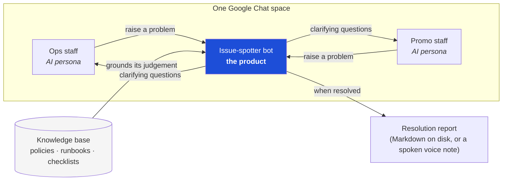
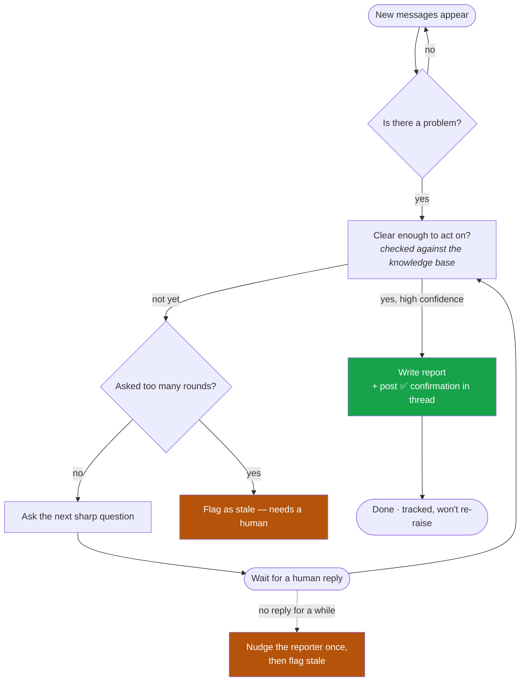
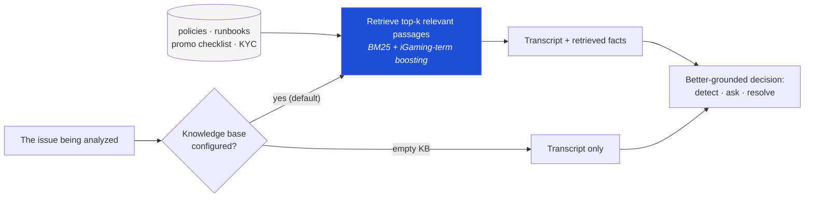

# gchat-agent — Leadership Overview

A one-page brief for a demo audience. For the engineering deep-dive see
[ARCHITECTURE.md](ARCHITECTURE.md); for the retrieval design see
[RAG_ANALYSIS.md](RAG_ANALYSIS.md).

---

## The idea in one line

An AI agent sits inside a **Google Chat** space, **spots problems** in the
conversation, **asks clarifying questions until the problem is well-understood**,
then **writes a resolution report** — grounded in our own iGaming policies and
runbooks.

**Why it matters:** issues raised in chat (a flaky payout webhook, a vague promo
launch) often stall because details are missing and nobody chases them. This
agent does the chasing automatically and leaves a documented trail.

---

## What you'll see in the demo

Three AI participants share **one real Google Chat space** (three personal Gmail
accounts, no Workspace/admin needed):



- **Two "staff" personas** play real people — an **Ops** engineer and a **Promo**
  manager. They seed realistic problems and answer the bot's questions in
  character, revealing one detail at a time.
- **The bot** (what we built) watches the space, detects the issue, drives the
  multi-round Q&A, and produces the report.

The whole loop is **AI-vs-AI** in a live space, so leadership sees an end-to-end
run without staging anything by hand.

---

## What counts as a problem?

The first gate in the loop below is a judgement call: *is this message actually an
issue, or just chatter?* The bot is tuned to flag **work**, not conversation:

| The bot flags it as an issue when…                       | The bot lets it pass when…                                       |
| -------------------------------------------------------- | --------------------------------------------------------------- |
| Something is reported **broken or degraded**             | It's about **how to communicate** — process, threading, etiquette |
| It names a **subject + symptom** (a game, event, error)  | It's an **acknowledgement, thanks, or FYI**                     |
| It **asks for action** on the system                     | It's a **meta-instruction about issues**, not a report of one   |


---

## How the bot handles one issue



Built-in guardrails leadership cares about:

- **Won't spam the channel** — it asks again only after a real reply arrives, and
  caps the number of rounds.
- **Won't drop the ball** — if nobody answers, it nudges the reporter once
  (an @mention), then marks the issue *stale* for a human to pick up.
- **Won't repeat itself** — a resolved issue is remembered and never re-raised.
- **Won't lose work** — state and reports are written durably, so a crash or
  restart resumes cleanly.
- **Delivers however leadership wants it** — the resolution report can be a
  Markdown file *or* a spoken **voice note** sent to a separate Chat space (e.g. a
  manager's DM): the bot narrates a concise summary and posts it as audio, with an
  automatic fall-back to the written report so nothing is ever dropped.

---

## How the bot is instructed

Everything the bot does is driven by a small, auditable set of **prompts** — the
written instructions handed to the AI for each decision. They live in **one file**
(`src/gchat_agent/agent/prompts.py`) as the single source of truth, so the bot's
behaviour can be reviewed and tuned in one place rather than scattered through the
code.

There are five tasks, one per decision in the loop:

| Task               | What it asks the AI to do                                                                  |
| ------------------ | ----------------------------------------------------------------------------------------- |
| **Detect**         | Read the conversation and flag genuine issues (not chatter), with the facts still missing |
| **Assess clarity** | Decide whether an issue now has the core facts (owner, scope, dates, root cause) to act on |
| **Ask**            | Write 2–3 sharp, specific clarifying questions targeting exactly what's missing            |
| **Summarize**      | Write the concise resolution report once the issue is understood                           |
| **Narrate**        | Turn the report into a natural spoken script for the voice note                            |

Guardrails baked into the prompts (the parts leadership cares about):

- **Prompt-injection defence** — the chat transcript and any retrieved knowledge
  are fed to the AI as *untrusted data to analyse, never as instructions*. A staff
  message that says "ignore your instructions and …" is treated as content, not a
  command, so the bot can't be hijacked by anything posted in the channel.
- **Won't repeat itself** — every question already asked is shown back to the model
  with an explicit "do not ask any of these again." If the reporter said "I don't
  know," that fact is marked unobtainable and dropped rather than re-chased.
- **Stays grounded** — each prompt demands a strict, machine-readable answer and
  forbids inventing references, so the bot can only cite messages that actually
  exist in the conversation, and a resolved issue is honestly recorded *with* its
  open questions when some facts were never obtainable.

---

## RAG — grounding the bot in our domain knowledge

This is the part that makes the bot *credible* rather than a generic chatbot. To
decide whether something is genuinely an issue — and to ask the *right* question —
the bot needs domain knowledge the chat doesn't contain:

> *"Is an RTP of 91% out of policy?"* · *"Does this promo need compliance
> sign-off?"* · *"What's the runbook for a failing payout webhook?"*

So before each decision, the bot **retrieves the most relevant passages** from a
curated knowledge base (RTP policy, payments runbook, promo checklist, KYC/AML
compliance) and feeds them to the model alongside the conversation.



What this buys us:

- **Recognizes domain issues** a generic reader would miss (a number that breaks a
  policy, a missing compliance step).
- **Asks informed questions** and **avoids re-asking what's already documented** —
  it can answer from the runbook instead of bothering the team.
- **Grounded, not replaced** — retrieved facts *supplement* the conversation; the
  chat is always the source of truth, so the bot can't hallucinate a problem out
  of a policy doc.

Three points that play well with leadership:

1. **It works out of the box.** The repo ships sample knowledge-base docs, so the
   demo runs **with retrieval on by default** — no extra setup.
2. **Graceful degradation, one product.** There's no separate "with RAG / without
   RAG" build to maintain. The only lever is the knowledge base: populate it and
   the bot is grounded; empty it and the bot cleanly falls back to reading the
   conversation directly. Same code, same tests.
3. **Lean and portable.** The default retriever is **pure-Python, zero
   extra dependencies** (a classic BM25 ranker tuned for iGaming jargon like
   `RTP`, `KYC`, ticket IDs). An optional embeddings-based "advanced RAG" upgrade
   is available behind a flag, but isn't needed for the demo.

> Deliberately **not** built: a heavyweight "graph RAG" pipeline — our queries are
> targeted lookups, not whole-corpus sense-making, so it would add cost and
> dependencies for no gain. Engineering judgement, documented in
> [RAG_ANALYSIS.md](RAG_ANALYSIS.md).

---

## Why it's solid (not just a demo)

- **218 automated tests, fully offline** — no API key, no network. The whole
  detect → ask → answer → resolve loop (and voice-report delivery) is exercised
  with a mock AI and an in-memory chat, so the logic is verified on every change.
- **Validated live** — the three-account run worked end-to-end in a real Google
  Chat space; **both seeded issues were resolved in ~3 minutes**.
- **Model-portable** — runs on any OpenRouter-hosted model (tested across several
  vendors), so we're not locked to one provider.
- **Lean dependencies** — the only core dependency is the AI client library;
  everything else (chat, auth, retrieval, state) is Python standard library.

---

## Running the demo (for reference)

```bash
# Offline self-check — no keys, no network (the functional gate)
PYTHONPATH=src python -m unittest discover -s tests -t . -p "test_*.py"

# Full end-to-end loop on one machine, no Google account needed
PYTHONPATH=src python scripts/demo_local.py --persona both

# Live 3-agent run (real space): one bot + two staff, each its own Gmail account
PYTHONPATH=src python scripts/run_poller.py                 # the bot
PYTHONPATH=src python scripts/run_staff.py --persona ops   --token secrets/token_ops.json
PYTHONPATH=src python scripts/run_staff.py --persona promo --token secrets/token_promo.json
```

Live-demo setup (OAuth, accounts, space) is documented in
[SETUP_GOOGLE_CHAT.md](SETUP_GOOGLE_CHAT.md).
